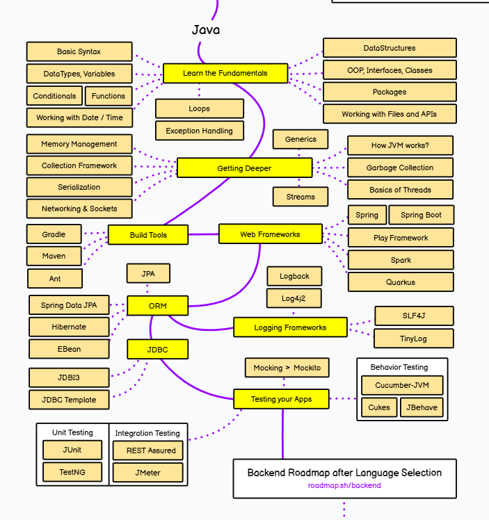

## Java Aprendizado

 

**Este repositório é dedicado ao meu processo de aprendizado e prática com Java. Aqui você encontrará uma coleção de desafios, exercícios e projetos que estou desenvolvendo para aprimorar minhas habilidades em programação Java.**

 

### O que você encontrará aqui:
- **Desafios de Programação**: Soluções e melhorias para problemas de programação que estou resolvendo.
- **Exercícios de Código**: Exemplos de exercícios e práticas para reforçar conceitos de Java.
- **Projetos**: Projetos em andamento e concluídos que mostram a aplicação de conceitos aprendidos.

### Objetivos:
- Praticar e solidificar conhecimentos em Java.
- Explorar e resolver desafios de programação para desenvolver habilidades práticas.
- Compartilhar e documentar o progresso no aprendizado de Java.

Sinta-se à vontade para explorar, sugerir melhorias ou contribuir com este repositório!
